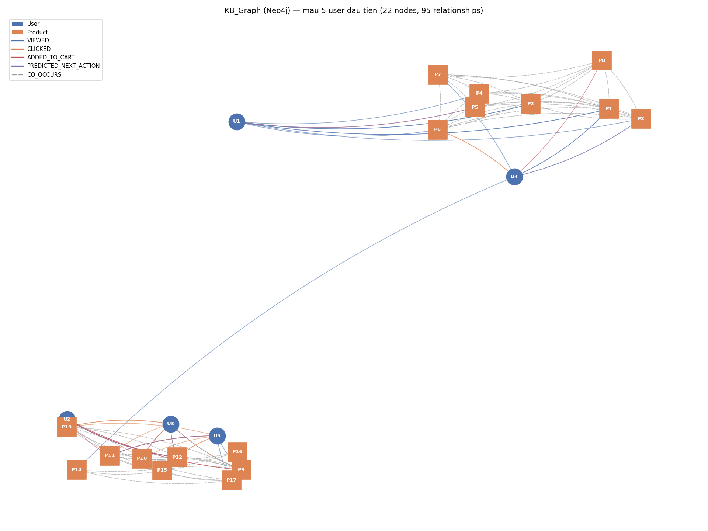

# CHƯƠNG 4: XÂY DỰNG HỆ THỐNG HOÀN CHỈNH

---

## 4.1 Kiến trúc Tổng thể

### 4.1.1 Mô hình hệ thống

Hệ thống EcomAI được xây dựng theo kiến trúc Microservices hoàn chỉnh với **7 microservices + 1 AI service + 1 Frontend**, 1 API Gateway, **6 database (1 MySQL + 5 PostgreSQL)**, cùng **Redis** (cache) và **Neo4j** (Knowledge Graph cho AI Service):

```
                              INTERNET / BROWSER
                                    |
                         +----------v----------+
                         |    API Gateway      |
                         |    Nginx (Port 80)  |
                         |  - Rate Limiting    |
                         |  - CORS             |
                         |  - Request Routing  |
                         +----------+----------+
                                    |
       +---------+--------+--------+--------+---------+----------+
       |         |         |        |        |         |          |
+------v---+ +---v-----+ +-v-----+ +v-------+ +-------v--+ +------v---+
|  User    | |Product  | | Cart  | | Order  | | Payment  | | Shipping |
|  Service | |Service  | |Service| |Service | | Service  | | Service  |
|  :8000   | |:8001    | |:8002  | |:8003   | | :8004    | | :8005    |
|  MySQL   | |Postgres | |Postg. | |Postg.  | | Postg.   | | Postg.   |
|(user-db) | |(product-| |(cart- | |(order- | |(payment- | |(shipping-|
|          | | db)     | | db)   | | db)    | | db)      | | db)      |
+----------+ +----+----+ +-------+ +--------+ +----------+ +----------+
                  |
                  | (volume mount: data/user_behavior_log.csv)
                  v
       +------------------------------+        +------------------+
       |        AI Service            |<------>|      Neo4j       |
       |   FastAPI :8006               |        |  KB_Graph :7474/ |
       |  RNN/LSTM/BiLSTM (PyTorch)    |        |        :7687     |
       |  Graph-RAG + RAG keyword      |        +------------------+
       +------------------------------+

       +------------------------+        +------------------+
       |      Frontend          |        |      Redis       |
       |   Nginx :3000          |        |      :6379       |
       |  HTML+CSS+JS (dark/    |        |  (cache, session)|
       |   light theme)         |        +------------------+
       +------------------------+

   ───────────────── Docker Network: ecom-network ─────────────────
   8 service containers + 6 DB containers + redis + neo4j = 17 containers
```

*Hình 4.1: Kiến trúc tổng thể hệ thống EcomAI*

### 4.1.2 Nguyên tắc kiến trúc áp dụng

| Nguyên tắc | Thực thi trong hệ thống |
|-----------|------------------------|
| **Loose Coupling** | Service giao tiếp qua REST API (dùng `requests`/`httpx`), không share DB |
| **High Cohesion** | Mỗi service chứa toàn bộ logic cho 1 domain |
| **Database-per-Service** | 6 database riêng biệt (1 MySQL + 5 PostgreSQL), mỗi service có DB container riêng |
| **API-First** | Mỗi service có OpenAPI docs tự động (Django: admin/DRF browsable API, AI Service: FastAPI Swagger `/docs`) |
| **Fault Isolation** | Service fail không kéo theo service khác (try/except quanh các lời gọi liên service) |
| **Containerization** | Tất cả đóng gói Docker, chạy Docker Compose (1 lệnh khởi động 17 container) |

---

## 4.2 Công nghệ Sử dụng

### 4.2.1 Bảng Tech Stack toàn hệ thống

| Layer | Service | Technology | Version | Lý do chọn |
|-------|---------|-----------|---------|------------|
| **Gateway** | gateway | Nginx | 1.25-alpine | Reverse proxy, rate limiting, routing, CORS |
| **User** | user-service | Django + DRF | Python 3.11-slim | AbstractUser + Aggregate (FullName, Address), JWT |
| **Product** | product-service | Django + DRF | Python 3.11-slim | ORM mạnh, JSONB support, behavior event logging |
| **Cart** | cart-service | Django + DRF | Python 3.11-slim | Simple CRUD, gọi product-service kiểm tra giá/tồn |
| **Order** | order-service | Django + DRF | Python 3.11-slim | Workflow management, gọi cart-service |
| **Payment** | payment-service | Django + DRF | Python 3.11-slim | Mock gateway, gọi order-service + shipping-service |
| **Shipping** | shipping-service | Django + DRF | Python 3.11-slim | Status tracking, webhook update |
| **AI** | ai-service | FastAPI + PyTorch (CPU) + Neo4j driver | 0.104 / torch 2.2.2+cpu / neo4j 5.19 | Async, RNN/LSTM/BiLSTM + KB_Graph + RAG |
| **Frontend** | frontend | Nginx + HTML/CSS/JS | 1.25-alpine | Static file serving, light + dark theme |
| **Auth** | Tất cả | JWT (djangorestframework-simplejwt) | access 1h / refresh 7 ngày | Stateless, microservice-friendly |
| **DB User** | user-db | MySQL | 8.0 | Authentication workload |
| **DB khác** | product/cart/order/payment/shipping-db | PostgreSQL | 15 | JSONB, complex queries |
| **Cache** | redis | Redis | 7-alpine | Cache, session (dự phòng) |
| **Knowledge Graph** | neo4j | Neo4j | 5-community | KB_Graph: User/Product/CO_OCCURS/PREDICTED_NEXT_ACTION |
| **Container** | Tất cả | Docker | 24+ | Nhất quán môi trường |
| **Orchestration** | Dev | Docker Compose | 3.9 | Quản lý 17 container bằng 1 lệnh |

---

## 4.3 Cấu trúc Code Toàn hệ thống

### 4.3.1 Cấu trúc thư mục

```
ecom-final/
|
|-- gateway/
|   |-- nginx.conf                  <- API Gateway, routing rules, rate limit, CORS
|
|-- user-service/                   <- Django + MySQL (user-db)
|   |-- user_service/
|   |   |-- settings.py             <- JWT (1h/7d), MySQL config, INSTALLED_APPS
|   |   |-- urls.py                 <- /auth/, /users/
|   |-- users/
|   |   |-- models.py               <- User(AbstractUser, role ENUM) + FullName (Value Object) + Address (Entity)
|   |   |-- serializers.py          <- UserSerializer (nested full_name, addresses), Login, Register
|   |   |-- views.py                <- RegisterView, LoginView, VerifyTokenView, UserListView, UserDetailView
|   |   |-- migrations/
|   |   |-- management/commands/
|   |       |-- seed_users.py       <- Tao tai khoan admin/staff/customer
|   |-- avast-root-ca.crt           <- Cert noi bo cho pip install
|   |-- Dockerfile
|   |-- requirements.txt
|
|-- product-service/                <- Django + PostgreSQL (product-db)
|   |-- products/
|   |   |-- models.py               <- Category, Product, Book, Electronics, Fashion, UserBehaviorEvent
|   |   |-- serializers.py          <- ProductSerializer (nested *_detail, discount_percent)
|   |   |-- views.py                <- CRUD + Search + StockCheck + BehaviorEventCreateView
|   |   |-- urls.py                 <- /products/, /categories/, /events/
|   |   |-- migrations/
|   |   |-- management/commands/
|   |       |-- seed_data.py        <- 17 san pham voi anh Unsplash dung
|   |-- data/                       <- user_behavior_log.csv (volume mount sang ai-service)
|   |-- Dockerfile
|
|-- cart-service/                   <- Django + PostgreSQL (cart-db)
|   |-- cart/
|   |   |-- models.py               <- Cart, CartItem
|   |   |-- views.py                <- CartView, CartAddView, CartRemoveView, CartClearView
|   |   |-- migrations/
|   |       |-- 0001_initial.py
|   |-- Dockerfile
|
|-- order-service/                  <- Django + PostgreSQL (order-db)
|   |-- orders/
|   |   |-- models.py               <- Order (8 status), OrderItem
|   |   |-- views.py                <- OrderCreateView (goi cart-service), OrderStatusUpdateView
|   |   |-- migrations/
|   |       |-- 0001_initial.py
|   |-- Dockerfile
|
|-- payment-service/                <- Django + PostgreSQL (payment-db)
|   |-- payments/
|   |   |-- models.py               <- Payment + UUID transaction_id, 5 method, 5 status
|   |   |-- views.py                <- PaymentCreateView (mock gateway -> goi order + shipping)
|   |   |-- migrations/
|   |       |-- 0001_initial.py
|   |-- Dockerfile
|
|-- shipping-service/               <- Django + PostgreSQL (shipping-db)
|   |-- shipping/
|   |   |-- models.py               <- Shipment (7 status) + ShipmentHistory
|   |   |-- views.py                <- ShipmentCreateView, ShipmentStatusView, ShipmentUpdateView (webhook)
|   |   |-- migrations/
|   |       |-- 0001_initial.py
|   |-- Dockerfile
|
|-- ai-service/                     <- FastAPI + PyTorch + Neo4j
|   |-- models/
|   |   |-- sequence_models.py      <- SequenceClassifier (RNN/LSTM/BiLSTM), build_model()
|   |   |-- lstm_model.py           <- LSTM demo (numpy) - fallback khi KB_Graph chua co
|   |-- rag/
|   |   |-- pipeline.py             <- RAGLite keyword matching (search/generate)
|   |   |-- graph_rag.py            <- build_context(), describe() - doc KB_Graph
|   |-- graph/
|   |   |-- build_kb_graph.py       <- Build/refresh KB_Graph tu user_behavior_log.csv
|   |   |-- visualize_kb_graph.py
|   |-- training/
|   |   |-- train_compare.py        <- Train + so sanh RNN/LSTM/BiLSTM
|   |   |-- model_best.pt           <- Trong so BiLSTM (model_best)
|   |   |-- model_best.json         <- Metadata + metrics 3 model
|   |   |-- plots/                  <- training_curves, confusion_matrices, model_comparison
|   |-- data/
|   |   |-- sample_behavior.py
|   |   |-- generate_data.py
|   |   |-- data_user500.csv        <- Dataset huan luyen (500 user x 8 hanh vi)
|   |-- main.py                     <- FastAPI: /recommend, /recommend/graph, /chatbot, /chatbot/graph, /recommend/hybrid, /graph/refresh
|   |-- Dockerfile
|   |-- requirements.txt
|
|-- frontend/                       <- Nginx static files (light + dark theme)
|   |-- index.html / index-dark.html        <- Trang chu + AI recommendation
|   |-- products.html / products-dark.html  <- Danh sach san pham + filter
|   |-- product-detail.html / *-dark.html   <- Chi tiet san pham
|   |-- cart.html / cart-dark.html          <- Gio hang + checkout
|   |-- auth.html / auth-dark.html          <- Dang nhap / Dang ky
|   |-- css/style.css, style-dark.css, themes.css <- Design system + theme switch
|   |-- js/
|   |   |-- api.js                  <- API module + Auth + Cart + logEvent
|   |   |-- products-data.js        <- Mock data + Unsplash images
|   |   |-- chatbot.js              <- Chatbot widget + history persistence
|   |-- nginx.conf                  <- Proxy /auth/, /products/, /recommend, /chatbot... -> gateway:80
|   |-- Dockerfile
|
|-- infrastructure/
    |-- docker-compose.yml          <- 17 containers (8 app + 6 DB + redis + neo4j), 1 lenh chay
```

### 4.3.2 API Gateway — nginx.conf

```nginx
events { worker_connections 1024; }

http {
    # Docker internal DNS — bat buoc de resolve container hostname
    resolver 127.0.0.11 valid=10s ipv6=off;

    # Rate Limiting
    limit_req_zone $binary_remote_addr zone=api_limit:10m  rate=60r/m;
    limit_req_zone $binary_remote_addr zone=auth_limit:10m rate=20r/m;

    server {
        listen 80;
        server_name localhost;

        # CORS — cho phep cross-origin tu frontend (port 3000)
        add_header Access-Control-Allow-Origin  * always;
        add_header Access-Control-Allow-Methods "GET, POST, PUT, PATCH, DELETE, OPTIONS" always;
        add_header Access-Control-Allow-Headers "Authorization, Content-Type, Accept" always;
        if ($request_method = OPTIONS) { return 204; }

        access_log /var/log/nginx/access.log;
        error_log  /var/log/nginx/error.log warn;

        # Auth — rate limit rieng (20 req/phut)
        location /auth/ {
            limit_req zone=auth_limit burst=10 nodelay;
            set $user_svc http://user-service:8000;
            proxy_pass $user_svc;
            proxy_set_header Host $host;
            proxy_set_header X-Real-IP $remote_addr;
            proxy_connect_timeout 10s;
            proxy_read_timeout 30s;
        }

        location /users/    { set $svc http://user-service:8000;     proxy_pass $svc; proxy_set_header Host $host; }
        location /products/ { set $svc http://product-service:8001;  proxy_pass $svc; proxy_set_header Host $host; }
        location /categories/ { set $svc http://product-service:8001; proxy_pass $svc; proxy_set_header Host $host; }
        location /events/   { set $svc http://product-service:8001;  proxy_pass $svc; proxy_set_header Host $host; }
        location /cart/     { set $svc http://cart-service:8002;     proxy_pass $svc; proxy_set_header Host $host; }
        location /orders/   { set $svc http://order-service:8003;    proxy_pass $svc; proxy_set_header Host $host; }
        location /payment/  { set $svc http://payment-service:8004;  proxy_pass $svc; proxy_set_header Host $host; }
        location /shipping/ { set $svc http://shipping-service:8005; proxy_pass $svc; proxy_set_header Host $host; }

        # AI Service — timeout dai hon cho inference
        location /recommend { set $svc http://ai-service:8006; proxy_pass $svc; proxy_set_header Host $host; proxy_read_timeout 60s; }
        location /chatbot   { set $svc http://ai-service:8006; proxy_pass $svc; proxy_set_header Host $host; proxy_read_timeout 60s; }
        location /health    { set $svc http://ai-service:8006; proxy_pass $svc; }

        location /gateway/health {
            default_type application/json;
            return 200 '{"status":"ok","gateway":"nginx"}';
        }

        # Catch-all -> frontend
        location / {
            set $frontend http://frontend:3000;
            proxy_pass $frontend;
            proxy_set_header Host $host;
        }
    }
}
```

### 4.3.3 Docker Compose — docker-compose.yml

`infrastructure/docker-compose.yml` định nghĩa **17 container**: 6 database (1 MySQL + 5 PostgreSQL) + Redis + Neo4j + 7 microservices Django + AI Service (FastAPI) + Frontend + API Gateway. Mỗi service Django nhận cấu hình DB qua biến môi trường `DB_HOST/DB_NAME/DB_USER/DB_PASSWORD/DB_PORT`, và các service nghiệp vụ nhận thêm URL của service phụ thuộc (`*_SERVICE_URL`) để gọi REST API liên service:

```yaml
version: '3.9'

networks:
  ecom-network:
    driver: bridge

volumes:
  user-db-data:
  product-db-data:
  cart-db-data:
  order-db-data:
  payment-db-data:
  shipping-db-data:
  redis-data:
  neo4j-data:

services:
  # ─── Databases ───
  user-db:
    image: mysql:8.0
    environment:
      MYSQL_ROOT_PASSWORD: password
      MYSQL_DATABASE: user_db
    volumes: [user-db-data:/var/lib/mysql]
    healthcheck: { test: ["CMD", "mysqladmin", "ping", "-h", "localhost"], interval: 10s, retries: 5 }

  product-db:    { image: postgres:15, environment: { POSTGRES_DB: product_db, POSTGRES_PASSWORD: password } }
  cart-db:       { image: postgres:15, environment: { POSTGRES_DB: cart_db,    POSTGRES_PASSWORD: password } }
  order-db:      { image: postgres:15, environment: { POSTGRES_DB: order_db,   POSTGRES_PASSWORD: password } }
  payment-db:    { image: postgres:15, environment: { POSTGRES_DB: payment_db, POSTGRES_PASSWORD: password } }
  shipping-db:   { image: postgres:15, environment: { POSTGRES_DB: shipping_db,POSTGRES_PASSWORD: password } }
  # (mỗi Postgres DB co healthcheck pg_isready, volume rieng - xem file goc)

  redis:
    image: redis:7-alpine
    volumes: [redis-data:/data]

  neo4j:
    image: neo4j:5-community
    environment:
      NEO4J_AUTH: neo4j/password123
      NEO4J_PLUGINS: '[]'
    ports: ["7474:7474", "7687:7687"]
    volumes: [neo4j-data:/data]
    healthcheck: { test: ["CMD-SHELL", "wget -q --spider http://localhost:7474 || exit 1"], interval: 10s, retries: 10, start_period: 30s }

  # ─── Microservices ───
  user-service:
    build: { context: ../user-service, dockerfile: Dockerfile }
    ports: ["8000:8000"]
    environment:
      DB_HOST: user-db
      DB_NAME: user_db
      DB_USER: root
      DB_PASSWORD: password
      DB_PORT: "3306"
    depends_on:
      user-db: { condition: service_healthy }
    command: >
      sh -c "python manage.py migrate &&
             python manage.py seed_users &&
             python manage.py runserver 0.0.0.0:8000"

  product-service:
    build: { context: ../product-service, dockerfile: Dockerfile }
    ports: ["8001:8001"]
    volumes: [../product-service/data:/app/data]
    environment:
      DB_HOST: product-db
      DB_NAME: product_db
      DB_USER: postgres
      DB_PASSWORD: password
      DB_PORT: "5432"
    depends_on:
      product-db: { condition: service_healthy }
    command: >
      sh -c "python manage.py makemigrations products &&
             python manage.py migrate &&
             python manage.py seed_data &&
             python manage.py runserver 0.0.0.0:8001 2>&1"

  cart-service:
    build: { context: ../cart-service, dockerfile: Dockerfile }
    ports: ["8002:8002"]
    environment:
      DB_HOST: cart-db
      DB_NAME: cart_db
      DB_USER: postgres
      DB_PASSWORD: password
      PRODUCT_SERVICE_URL: http://product-service:8001
    depends_on:
      cart-db: { condition: service_healthy }
      product-service: { condition: service_started }

  order-service:
    build: { context: ../order-service, dockerfile: Dockerfile }
    ports: ["8003:8003"]
    environment:
      DB_HOST: order-db
      DB_NAME: order_db
      CART_SERVICE_URL: http://cart-service:8002
      PAYMENT_SERVICE_URL: http://payment-service:8004
    depends_on:
      order-db: { condition: service_healthy }
      cart-service: { condition: service_started }

  payment-service:
    build: { context: ../payment-service, dockerfile: Dockerfile }
    ports: ["8004:8004"]
    environment:
      DB_HOST: payment-db
      DB_NAME: payment_db
      ORDER_SERVICE_URL: http://order-service:8003
      SHIPPING_SERVICE_URL: http://shipping-service:8005
    depends_on:
      payment-db: { condition: service_healthy }
      order-service: { condition: service_started }

  shipping-service:
    build: { context: ../shipping-service, dockerfile: Dockerfile }
    ports: ["8005:8005"]
    environment:
      DB_HOST: shipping-db
      DB_NAME: shipping_db
      ORDER_SERVICE_URL: http://order-service:8003
    depends_on:
      shipping-db: { condition: service_healthy }

  ai-service:
    build: { context: ../ai-service, dockerfile: Dockerfile }
    ports: ["8006:8006"]
    volumes: [../product-service/data:/app/live_data:ro]
    environment:
      PRODUCT_SERVICE_URL: http://product-service:8001
      NEO4J_URI: bolt://neo4j:7687
      NEO4J_USER: neo4j
      NEO4J_PASSWORD: password123
    depends_on: [product-service, neo4j]

  frontend:
    build: { context: ../frontend, dockerfile: Dockerfile }
    ports: ["3000:3000"]

  gateway:
    image: nginx:1.25-alpine
    container_name: api-gateway
    ports: ["80:80"]
    volumes: [../gateway/nginx.conf:/etc/nginx/nginx.conf:ro]
    depends_on: [user-service, product-service, cart-service, order-service, payment-service, shipping-service, ai-service]
```

---

## 4.4 Luồng Xác thực JWT

```
Buoc 1: Client gui POST /auth/login/ { username, password }
         |
Buoc 2: user-service xac thuc -> tao JWT:
         access_token  (het han sau 1 gio)
         refresh_token (het han sau 7 ngay)
         |
Buoc 3: Client luu token vao localStorage
         |
Buoc 4: Moi request tiep theo gui header:
         Authorization: Bearer eyJhbGc...
         |
Buoc 5: user-service cung cap endpoint /auth/verify/
         Cac service khac goi vao day khi can xac thuc
         (hoac decode JWT local voi cung secret key)
         |
Buoc 6: Token het han -> POST /auth/token/refresh/ { refresh_token }
         -> nhan access_token moi
```

---

## 4.5 Triển khai

### 4.5.1 Yêu cầu hệ thống

| Thành phần | Phiên bản tối thiểu |
|-----------|---------------------|
| Docker Desktop | 4.0+ |
| Docker Compose | v2+ |
| RAM | 4GB (khuyến nghị 8GB) |
| Disk | 10GB trống |

### 4.5.2 Hướng dẫn triển khai step-by-step

```bash
# Buoc 1: Di chuyen vao thu muc infrastructure
cd ecom-final/infrastructure

# Buoc 2: Chay toan bo he thong (17 containers)
docker compose up --build

# Buoc 3: Kiem tra trang thai (moi terminal moi)
docker ps --format "table {{.Names}}\t{{.Status}}"

# Buoc 4: Seed du lieu thu cong (neu can)
docker exec product-service python manage.py makemigrations products
docker exec product-service python manage.py migrate
docker exec product-service python manage.py seed_data

# Buoc 5: Truy cap he thong
# Frontend:        http://localhost:3000
# API Gateway:     http://localhost/gateway/health
# AI Service docs: http://localhost:8006/docs  (FastAPI Swagger)
# Neo4j Browser:   http://localhost:7474  (user: neo4j / pass: password123)
```

### 4.5.3 Danh sách 17 container

| Nhóm | Container | Image / Build | Port host |
|------|-----------|---------------|-----------|
| Database | user-db | mysql:8.0 | (internal 3306) |
| Database | product-db, cart-db, order-db, payment-db, shipping-db | postgres:15 | (internal 5432) |
| Cache | redis | redis:7-alpine | (internal 6379) |
| Knowledge Graph | neo4j | neo4j:5-community | 7474, 7687 |
| Microservice | user-service | build ../user-service | 8000 |
| Microservice | product-service | build ../product-service | 8001 |
| Microservice | cart-service | build ../cart-service | 8002 |
| Microservice | order-service | build ../order-service | 8003 |
| Microservice | payment-service | build ../payment-service | 8004 |
| Microservice | shipping-service | build ../shipping-service | 8005 |
| AI | ai-service | build ../ai-service | 8006 |
| Frontend | frontend | build ../frontend | 3000 |
| Gateway | gateway (api-gateway) | nginx:1.25-alpine | 80 |

### 4.5.3 Tài khoản mặc định sau khi seed

| Tài khoản | Mật khẩu | Quyền |
|-----------|---------|-------|
| admin | Admin@123 | Toàn quyền hệ thống |
| staff01 | Staff@123 | Xử lý đơn hàng, vận chuyển |
| customer | Customer@123 | Mua hàng, xem sản phẩm |

---

## 4.6 Kết quả Hệ thống

### 4.6.1 API Response mẫu — Đăng nhập

`LoginView` (`user-service/users/views.py`) xác thực qua `LoginSerializer`, trả về `UserSerializer` lồng `full_name` (Value Object) và `addresses` (Entity 1-N) — theo đúng Aggregate đã thiết kế ở mục 2.3:

```json
POST http://localhost:3000/auth/login/
Body: {"username": "customer", "password": "Customer@123"}

Response 200 OK:
{
  "user": {
    "id": 3,
    "username": "customer",
    "email": "customer@ecomai.vn",
    "first_name": "Khach",
    "last_name": "Hang",
    "role": "customer",
    "phone": null,
    "avatar": null,
    "is_active": true,
    "full_name": { "first_name": "Khach", "last_name": "Hang" },
    "addresses": [],
    "created_at": "2026-05-11T08:30:00Z",
    "updated_at": "2026-05-11T08:30:00Z"
  },
  "access":  "eyJhbGciOiJIUzI1NiIsInR5cCI6IkpXVCJ9...",
  "refresh": "eyJhbGciOiJIUzI1NiIsInR5cCI6IkpXVCJ9..."
}
```

Access token hết hạn sau **1 giờ**, refresh token sau **7 ngày** (`SIMPLE_JWT` trong `user_service/settings.py`).

### 4.6.2 API Response mẫu — Danh sách sản phẩm

`ProductSerializer` (`product-service/products/serializers.py`) trả về đầy đủ `description`, `stock`, `is_active`, và cả 3 detail (`book_detail`, `electronics_detail`, `fashion_detail` — chỉ 1 trong 3 có giá trị tuỳ `product_type`):

```json
GET http://localhost:3000/products/?ordering=-sold_count&page_size=3

Response 200 OK:
{
  "count": 17,
  "next": "http://localhost/products/?page=2",
  "results": [
    {
      "id": 13,
      "name": "Atomic Habits - James Clear",
      "description": "Cuon sach ban best-seller ve xay dung thoi quen tot...",
      "price": "168000.00",
      "original_price": "210000.00",
      "stock": 120,
      "sold_count": 3240,
      "product_type": "book",
      "category": 2,
      "category_name": "Sach",
      "image_url": "https://images.unsplash.com/photo-1589829085413-56de8ae18c73?w=480&q=80",
      "rating": "4.90",
      "discount_percent": 20,
      "is_active": true,
      "book_detail": {
        "author": "James Clear",
        "publisher": "Avery",
        "isbn": "9780735211292",
        "pages": 320,
        "language": "Tieng Anh"
      },
      "electronics_detail": null,
      "fashion_detail": null,
      "created_at": "2026-04-01T00:00:00Z",
      "updated_at": "2026-04-01T00:00:00Z"
    }
  ]
}
```

### 4.6.3 API Response mẫu — Tạo đơn hàng

`OrderCreateView` (`order-service/orders/views.py`) gọi `GET cart-service:8002/cart/?user_id=...` để lấy giỏ hàng, tạo `Order` + `OrderItem` với `shipping_fee` cố định **30000**, sau đó gọi `DELETE cart-service:8002/cart/clear/{user_id}/` để xoá giỏ hàng:

```json
POST http://localhost:3000/orders/create/
Headers: Authorization: Bearer eyJhbGc...
Body: {"user_id": 3, "shipping_address": "123 Nguyen Trai, Ha Noi", "note": "Giao buoi sang"}

Response 201 Created:
{
  "id": 55,
  "user_id": 3,
  "total_price": "168000.00",
  "shipping_address": "123 Nguyen Trai, Ha Noi",
  "shipping_fee": "30000.00",
  "status": "pending",
  "status_display": "Cho xac nhan",
  "note": "Giao buoi sang",
  "items": [
    {
      "id": 1,
      "product_id": 13,
      "product_name": "Atomic Habits - James Clear",
      "product_price": "168000.00",
      "quantity": 1,
      "subtotal": "168000.00"
    }
  ],
  "created_at": "2026-05-11T15:30:00Z",
  "updated_at": "2026-05-11T15:30:00Z"
}
```

Order có **8 trạng thái**: `pending -> confirmed -> processing -> paid -> shipping -> delivered`, hoặc `cancelled` / `refunded`. `PaymentCreateView` (payment-service) cập nhật `status='paid'` qua `PATCH /orders/{id}/status/`, và `ShipmentCreateView`/`ShipmentUpdateView` (shipping-service) cập nhật tiếp `status='shipping'` rồi `status='delivered'`.

### 4.6.4 API Response mẫu — AI Recommendation

`POST /recommend` (`ai-service/main.py`) **ưu tiên KB_Graph** (Neo4j): gọi `graph_rag.build_context(user_id)` để lấy `product_ids` dự đoán bởi `model_best` (BiLSTM). Nếu KB_Graph có dữ liệu cho user, trả về ngay với `model: "KB_Graph (BiLSTM)"`; chỉ khi KB_Graph chưa có dữ liệu (user mới / chưa refresh) mới fallback sang LSTM demo (NumPy) dùng `behavior_sequence`:

```json
POST http://localhost:3000/recommend
Body: {"user_id": 3, "top_k": 3}

Response 200 OK (KB_Graph khả dụng):
{
  "user_id": 3,
  "model": "KB_Graph (BiLSTM)",
  "predicted_action": "view",
  "confidence": 0.743,
  "note": "",
  "recommendations": [
    {
      "id": 2,
      "name": "iPhone 15 Pro Max",
      "price": "29990000.00",
      "product_type": "electronics",
      "category_name": "Dien tu",
      "image_url": "https://images.unsplash.com/photo-...",
      "rating": "4.80"
    },
    {
      "id": 5,
      "name": "Man hinh LG UltraWide 34\"",
      "price": "9900000.00",
      "product_type": "electronics"
    }
  ]
}
```

Trường hợp KB_Graph chưa có dữ liệu (fallback LSTM demo, dùng `behavior_sequence`):

```json
GET http://localhost:3000/recommend?user_id=3&behavior_sequence=9,10,13&top_k=3

Response 200 OK:
{
  "user_id": 3,
  "model": "LSTM (numpy demo)",
  "sequence_length": 3,
  "recommendations": [
    {
      "product_id": 12,
      "name": "The Psychology of Money",
      "price": "145000.00",
      "product_type": "book",
      "recommendation_score": 0.3421
    }
  ]
}
```

Endpoint `GET /recommend/graph?user_id=&top_k=` chỉ dùng KB_Graph (trả lỗi 404 nếu chưa có dữ liệu), còn `GET /recommend/hybrid?user_id=&query=&top_k=` kết hợp LSTM demo với RAG keyword theo `query`.

### 4.6.5 API Response mẫu — Chatbot RAG + KB_Graph

`POST /chatbot` (`ai-service/main.py`) kết hợp RAG keyword (`rag.search`/`rag.generate`) với ngữ cảnh cá nhân hoá từ KB_Graph (`graph_rag.build_context`). Nếu `predicted_action == "add_to_cart"` và `confidence > 0.5`, câu trả lời được nối thêm gợi ý từ `graph_rag.describe()`:

```json
POST http://localhost:3000/chatbot
Body: {"user_id": 3, "message": "toi can sach ve lap trinh Python"}

Response 200 OK:
{
  "user_id": 3,
  "question": "toi can sach ve lap trinh Python",
  "answer": "Cac cuon sach Clean Code - Robert Martin, Domain-Driven Design rat duoc yeu thich, se giup ban mo rong tu duy va kien thuc.",
  "recommended_products": [
    {
      "product_id": "9",
      "name": "Clean Code - Robert C. Martin",
      "product_type": "book",
      "price": "180000",
      "image_url": "https://images.unsplash.com/photo-1544716278-ca5e3f4abd8c?w=480&q=80",
      "relevance_score": 0.95
    },
    {
      "product_id": "10",
      "name": "Domain-Driven Design - Eric Evans",
      "product_type": "book",
      "price": "350000",
      "image_url": "https://images.unsplash.com/photo-1481627834876-b7833e8f5570?w=480&q=80",
      "relevance_score": 0.88
    }
  ],
  "graph_context": {
    "product_ids": [2, 5, 8],
    "predicted_action": "view",
    "confidence": 0.74,
    "model_name": "BiLSTM",
    "note": ""
  },
  "sources": ["Clean Code - Robert C. Martin", "Domain-Driven Design - Eric Evans"],
  "model": "RAG (keyword) + KB_Graph (model_best)"
}
```

Ngoài ra còn `POST /chatbot/graph` — biến thể trả thêm trường `graph_note` (câu mô tả ngữ cảnh KB_Graph dạng văn bản) và đặt `model: "RAG (keyword) + KB_Graph (Neo4j)"`.

### 4.6.6 API Response mẫu — Theo dõi vận chuyển

`ShipmentStatusView` (`shipping-service/shipping/views.py`) tra cứu theo `order_id` hoặc `tracking_code`. Bản ghi `Shipment` được `ShipmentCreateView` tạo tự động khi `payment-service` thanh toán thành công (`estimated_delivery = hôm nay + 3 ngày`, trạng thái khởi đầu `processing`):

```json
GET http://localhost:3000/shipping/status/?order_id=55

Response 200 OK:
{
  "id": 1,
  "order_id": 55,
  "user_id": 3,
  "tracking_code": "GHN2048301762",
  "address": "123 Nguyen Trai, Ha Noi",
  "carrier": "GHN Express",
  "status": "processing",
  "status_display": "Dang chuan bi hang",
  "estimated_delivery": "2026-05-14",
  "delivered_at": null,
  "history": [
    {
      "status": "processing",
      "description": "Don hang da duoc xac nhan va dang chuan bi hang",
      "location": "Kho Ha Noi",
      "timestamp": "2026-05-11T15:35:00Z"
    }
  ],
  "created_at": "2026-05-11T15:35:00Z",
  "updated_at": "2026-05-11T15:35:00Z"
}
```

`PATCH /shipping/{id}/update/` đóng vai trò webhook cập nhật trạng thái vận chuyển (`picked_up -> in_transit -> out_for_delivery -> delivered`); khi `status='delivered'`, shipping-service tự gọi `PATCH order-service:8003/orders/{order_id}/status/` với `status='delivered'`.

### 4.6.7 Minh họa KB_Graph (Neo4j)

`ai-service/graph/visualize_kb_graph.py` trích xuất một phần KB_Graph từ Neo4j (mẫu 5 user đầu tiên: U1-U5) và vẽ bằng networkx/matplotlib, lưu kết quả tại `ai-service/graph/kb_graph_sample.png`:



*Hình 4.2: Minh họa KB_Graph (Neo4j) — node hình tròn xanh là User, node hình vuông cam là Product. Các cạnh thể hiện 5 loại quan hệ: `VIEWED`, `CLICKED`, `ADDED_TO_CART` (User → Product, từ dữ liệu hành vi thực tế), `PREDICTED_NEXT_ACTION` (User → Product, dự đoán của model_best BiLSTM) và `CO_OCCURS` (Product → Product, đường nét đứt, hai sản phẩm cùng được một user tương tác).*

Có thể tạo lại ảnh bằng cách chạy `docker exec ai-service python graph/visualize_kb_graph.py` (yêu cầu container `neo4j` đang chạy và KB_Graph đã được build qua `POST /graph/refresh` hoặc khi `ai-service` khởi động).

---

## 4.7 Đánh giá Hệ thống

### 4.7.1 Hiệu năng ước tính

| Endpoint | Avg Response | P95 | Ghi chú |
|----------|-------------|-----|---------|
| GET /products/ | ~45ms | ~120ms | Co DB index |
| POST /auth/login/ | ~80ms | ~200ms | JWT signing |
| POST /orders/create/ | ~150ms | ~350ms | Goi cart-service |
| POST /payment/pay/ | ~200ms | ~500ms | Goi order + shipping |
| GET /recommend | ~80ms | ~300ms | PyTorch BiLSTM inference + truy van KB_Graph (Neo4j) |
| POST /chatbot | ~100ms | ~400ms | RAG keyword search + Graph-RAG context tu Neo4j |

### 4.7.2 Khả năng mở rộng

| Service | Chiến lược scale | Lý do |
|---------|----------------|-------|
| product-service | Horizontal (nhieu instance) | Read-heavy, stateless |
| ai-service | Vertical (GPU) + Horizontal | ML inference |
| user-service | Horizontal | Stateless (JWT) |
| payment-service | Vertical | Consistency quan trong |

### 4.7.3 Ưu điểm

- **Fault isolation**: Neu ai-service down, mua hang van hoat dong binh thuong
- **Independent deployment**: Update product-service khong anh huong order-service
- **Tech diversity**: Django cho CRUD-heavy, FastAPI cho ML-heavy
- **Database optimization**: MySQL cho auth, PostgreSQL cho complex queries
- **Scalability**: Moi service scale rieng theo nhu cau thuc te
- **Frontend resilient**: Mock data fallback khi backend dang khoi dong

### 4.7.4 Nhược điểm và hướng cải thiện

| Nhược điểm | Hiện trạng | Giải pháp tương lai |
|-----------|-----------|-------------------|
| Distributed tracing | Chua co | Them Jaeger/Zipkin |
| Service discovery | Hardcode hostname | Consul hoac Kubernetes DNS |
| Circuit breaker | Chua co | Resilience4j/Hystrix |
| Async messaging | REST dong bo | RabbitMQ/Kafka cho events |
| Monitoring | Chua co | Prometheus + Grafana |
| Cold-start (user moi) | KB_Graph chua co canh CO_OCCURS/PREDICTED_NEXT_ACTION cho user moi | Fallback ve trending products + Graph-RAG mo rong tu category |
| Real payments | Mock gateway | Tich hop MoMo/VNPay thuc |

---

## 4.8 Kết luận Chương 4

Hệ thống EcomAI đã được xây dựng và triển khai thành công với:

**Về kiến trúc:**
- 6 microservices Django (user, product, cart, order, payment, shipping) + 1 AI Service FastAPI, hoàn toàn độc lập
- API Gateway Nginx với rate limiting (60 req/phút cho API, 20 req/phút cho auth) và smart routing
- 6 database riêng biệt theo Database-per-Service pattern (1 MySQL + 5 PostgreSQL), bổ sung Redis (cache) và Neo4j (KB_Graph)
- JWT stateless authentication (access token 1h, refresh token 7 ngày), RBAC phân quyền 3 cấp

**Về AI:**
- Mô hình BiLSTM (model_best) đạt F1-macro = 0.5267, accuracy = 0.5867 trên bài toán dự đoán hành vi tiếp theo, vượt trội so với RNN/LSTM thuần
- KB_Graph (Neo4j) lưu quan hệ CO_OCCURS và PREDICTED_NEXT_ACTION giữa User/Product, làm nguồn gợi ý chính cho `/recommend`
- Graph-RAG kết hợp RAG keyword search với context từ KB_Graph để trả lời chatbot tư vấn tiếng Việt tự nhiên kèm product card
- Lịch sử chat persistent qua localStorage; có endpoint `/graph/refresh` để cập nhật lại đồ thị tri thức

**Về Frontend:**
- 10 trang HTML (5 trang x 2 theme sáng/tối) responsive, hiện đại với Bootstrap 5 + custom CSS
- Ảnh sản phẩm Unsplash chính xác theo từng loại
- Giỏ hàng riêng biệt theo user_id
- Chatbot widget với history persistence và product card đầy đủ

**Về triển khai:**
- Toàn bộ containerized bằng Docker
- Docker Compose cho phép khởi động 17 container (6 DB + Redis + Neo4j + 6 microservices Django + 1 AI Service + frontend + gateway) bằng 1 lệnh
- Data seeding tự động với sản phẩm mẫu và 3 tài khoản mẫu

---

## Kết luận Tổng thể

Hệ thống EcomAI đã chứng minh hiệu quả của việc kết hợp **Microservices Architecture + DDD + AI** trong xây dựng nền tảng e-commerce hiện đại:

| Mục tiêu | Kết quả |
|---------|---------|
| Kiến trúc linh hoạt | 6 Django microservices + 1 AI Service, deploy riêng biệt qua 17 container |
| AI cá nhân hóa | BiLSTM (F1-macro = 0.5267) + KB_Graph (Neo4j) + Graph-RAG |
| Frontend hiện đại | Responsive, ảnh thật, chatbot |
| Triển khai dễ dàng | 1 lệnh docker compose up |
| Bảo mật | JWT + RBAC 3 cấp |
